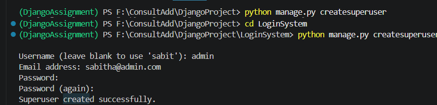
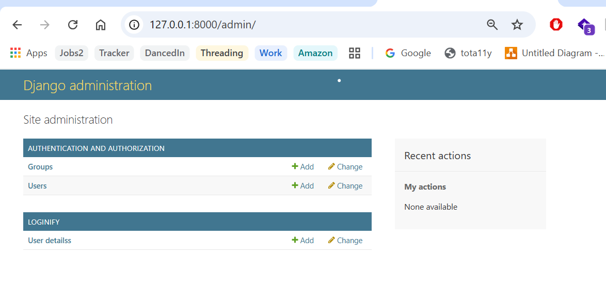
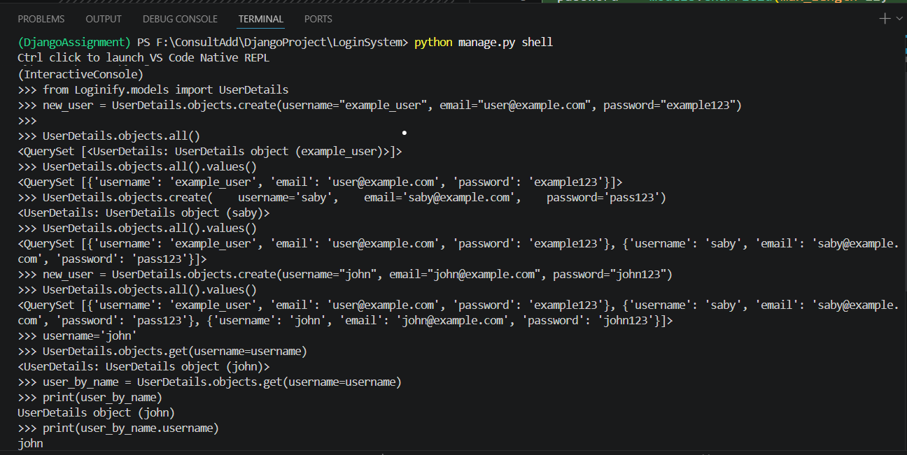
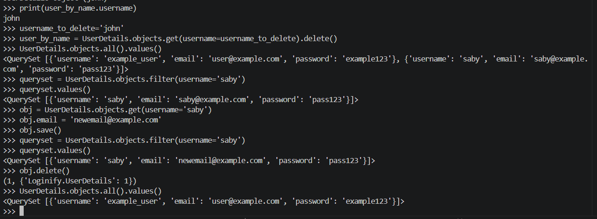
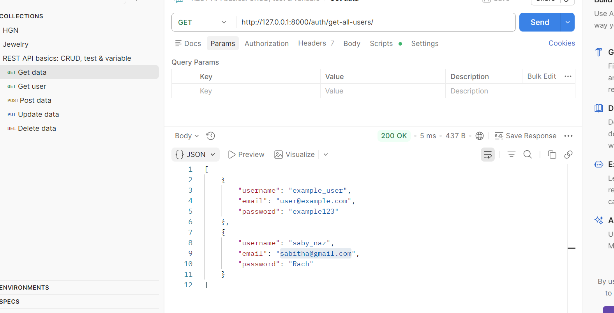
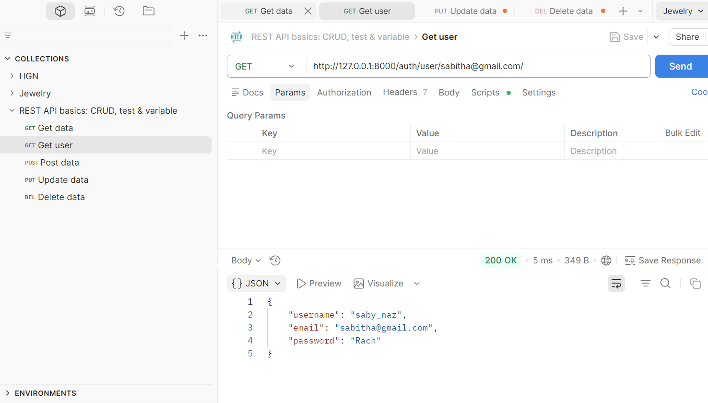
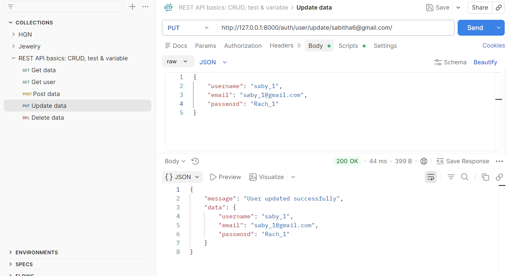
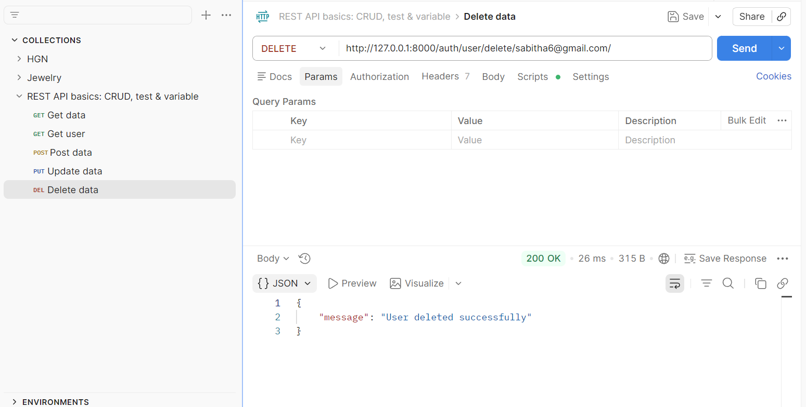
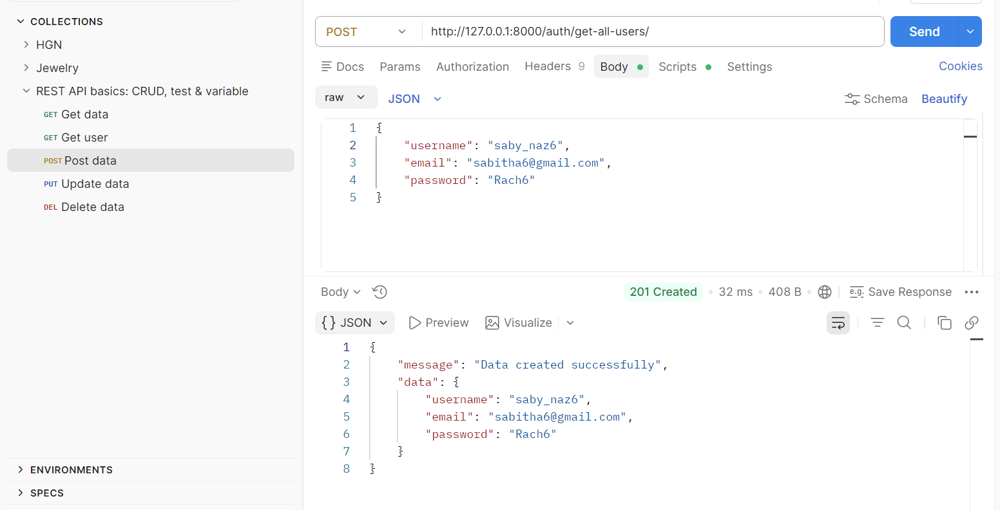

This Django project aims to create a robust system with features for user signup, login, and profile management.It includes functionalities such as user registration, user data retrieval, updating user details, and deleting user accounts.The project utilises Django's built-in features for model creation, views implementation, URL routing, and template rendering to achieve seamless user interaction and data management. Additionally, thorough testing with Postman ensures the reliability and functionality of the CRUD operations.

### Setting up project:
1. Create a virtual environment: "DjangoAssignment".
2. Create a new Django project: "LoginSystem"
3. Create a New Django Application: “Loginify”

### Create views and urls for login system:
1. Create login view within the Loginify that returns an HTTP response with the text "Hello, world!".
2. Define URL patterns in the "urls.py" file of the "Loginify" Django application to map views to specific URLs.

### Models and Admin
1. Setup Superuser () ()
2. Python manage.py shell
    a.Create a new user instance
    b.Retrieve all Users
    c.Retrieve a single user by name
    d.Delete a user by username
    e.Create a new instance using object
    f.Query objects
    g.Update an object
    h.Delete an object
  
  

### Crud Operations
1. Get all user details view: Retrieves and displays details of all users. ()
2. Get a single user using by email view: Retrieves and displays details of a specific user based on their name. ()
3. Update User details ()
4. To delete a user using its email. ()
5. Create user ()
